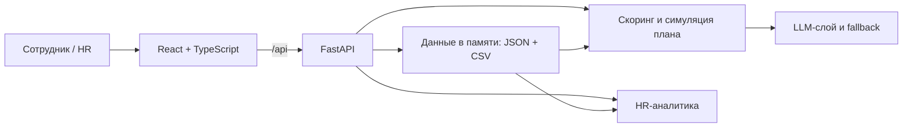

# Career Quest

**AI-навигатор развития сотрудника** · HackAlem AI 2026 · Halyk Bank, кейс 1

Сотруднику сложно понять, какие из десятков обучающих активностей действительно приближают его к следующей роли или грейду. Career Quest показывает карьерную цель, текущие разрывы навыков и предлагает до трёх конкретных шагов. Каждый шаг сопровождается объяснением: что он улучшит, почему подходит именно сейчас и как изменится готовность к цели.

> **Статус README:** рабочий каркас. Перед сдачей добавим подтверждённые результаты, скриншоты, ссылку на демо и проверенную команду запуска в Docker. Пункты `[TODO]` намеренно оставлены открытыми.

## Что увидит пользователь

- **Сотрудник:** профиль и траекторию, оценённый и эффективный уровни навыков, доступные активности, рекомендации с факторами и объяснением. После «Отметить пройденным» навыки и процент готовности обновляются.
- **HR:** навыки, по которым команда чаще всего отстаёт от цели, участие по активностям, сотрудников без подходящего шага и сигналы снижения вовлечённости. HR может загрузить дополнительные профили и историю или восстановить исходные данные.
- **Жюри:** проверяемую причину выбора и отказа от альтернатив. Например, самый низкий навык не обязательно становится приоритетом, если сотрудник неоднократно пропускал похожие занятия, а другой навык критичен для следующего грейда.

Данные синтетические. Публичного рейтинга сотрудников нет; профиль и история доступны самому сотруднику и HR, общая аналитика — только HR. В демо права задаются заголовками запросов, а не настоящей системой входа.

## Быстрый сценарий демо

1. Открыть сотрудника `E0028`: **Middle → Senior**, посмотреть цель, готовность и навыки. Эффективный уровень System Design уже включает занятие, пройденное после последней оценки.
2. Нажать **«Подобрать шаги»**: показать выбранную активность, факторы, ожидаемый прирост и блок «Почему не другой шаг?». Раскрыть trace работы рекомендательной системы.
3. Нажать **«Отметить пройденным»**: показать, как выросли навык и готовность, затем обновлённые рекомендации.
4. Переключиться в **HR обзор**: показать отстающие навыки, участие и загрузку тестовых профилей.

`[TODO]` Зафиксировать финальный 90-секундный сценарий, скриншоты и резервное видео после стабилизации приложения.

## Как запустить локально

Нужны Python 3.11+, [`uv`](https://docs.astral.sh/uv/) и Node.js 22+.

```bash
git clone https://github.com/BAITC-Hacks/hack-5fe3ca84-baursaq.git
cd hack-5fe3ca84-baursaq

# Терминал 1 — API
cd backend
uv sync
cp .env.example .env
# В backend/.env добавьте OPENAI_API_KEY для реального AI-ответа.
# Для проверки без сети установите USE_MOCKS=true.
uv run uvicorn app.main:app --reload

# Терминал 2 — интерфейс (из корня репозитория)
cd frontend
npm ci
npm run dev
```

Интерфейс: http://localhost:5173 · API и Swagger: http://localhost:8000/docs. В режиме разработки Vite перенаправляет `/api` на FastAPI.

`[TODO]` После появления `Dockerfile` и `docker-compose.yml` проверить с чистого клона и вынести сюда основную команду `docker compose up --build` → http://localhost:8000. Локальные команды выше оставить как вариант для разработки.

**Секреты:** ключи хранятся только в `backend/.env`, этот файл не коммитится. Образец переменных — [`backend/.env.example`](backend/.env.example). `USE_MOCKS=true` отключает обращения к LLM и оставляет детерминированную рекомендацию, чтобы демо работало без сети.

## Как работает рекомендация

1. **Уточняем цель.** Берём `career_goal`, если она задана; иначе следующий грейд текущей роли. Для Lead без цели остаётся текущий профиль роли.
2. **Считаем эффективные навыки.** К последней оценке добавляем прирост от активностей, завершённых *после* `last_review_date`. Отсутствующий навык считается уровнем 0. Прирост ограничен `max_level` мероприятия.
3. **Сравниваем с целевым профилем.** Готовность — доля закрытых требований по навыкам; критичные для целевого грейда навыки имеют двойной вес.
4. **Отбираем допустимые активности.** Учитываем роль, грейд, пререквизиты, расписание и уже пройденные мероприятия. Обязательные активности не рекомендуются. Самостоятельные курсы доступны без даты сессии.
5. **Строим план до трёх шагов.** Многофакторный скоринг учитывает закрываемый разрыв, критичность навыка, карьерную цель, историю успешных и сорванных участий, формат работы и затраты времени. После выбора шага движок симулирует прирост навыков и заново оценивает следующие кандидаты.
6. **Объясняем выбор.** Ответ показывает факторы, приросты и прогноз готовности, а также причины, по которым другие шаги отложены. Языки объяснения: `kk`, `ru`, `en`.

Ядро решения — детерминированный движок [`backend/app/services/engine.py`](backend/app/services/engine.py): он определяет кандидатов, ограничения и все численные значения. LLM может выбрать или переупорядочить только кандидатов движка и сформулировать объяснение; при ошибке или таймауте используется объяснение движка. Так рекомендацию можно воспроизвести и проверить, а модель не придумывает активности или уровни навыков.

`[TODO]` После интеграции OpenAI Agents SDK описать фактические инструменты агента, модель, лимит времени и пример trace из работающего демо. Сверить раздел с финальной реализацией.

## Архитектура



Исходный датасет находится в [`data/career_quest/`](data/career_quest/) и содержит 200 синтетических сотрудников, 60 навыков, 40 мероприятий и историю участия. Дата среза данных — **1 октября 2026 года**; она используется как «сегодня» при проверке будущих сессий. Описание полей и связей: [`README.ru.md`](data/career_quest/README.ru.md).

## Загрузка данных и API

В HR-экране можно перетащить `employees.json`, `activity_history.csv`, `events.json` или `skills.json` в формате исходного датасета. Допускается загрузка подмножества файлов; записи добавляются или обновляются в памяти процесса. Кнопка «Восстановить исходные данные» отменяет изменения демо.

| Действие | API |
|---|---|
| Статус и каталог | `GET /api/health`, `GET /api/catalog` |
| Поиск и профиль | `GET /api/employees?q=`, `GET /api/employees/{id}` |
| Рекомендации и прогресс | `POST /api/employees/{id}/recommendations`, `POST /api/employees/{id}/complete` |
| HR-аналитика | `GET /api/hr/overview` |
| Загрузка и сброс | `POST /api/dataset/upload`, `POST /api/dataset/reset` |

Демо-заголовки: `X-Role: employee|hr` и `X-Employee-Id: E0028`. Сотрудник видит только свой профиль, HR — общие данные и загрузку. Полная схема запросов и ответов доступна в Swagger: http://localhost:8000/docs.

`[TODO]` Добавить путь к трём тестовым профилям жюри и команду проверки, когда команда C закончит `data/test_profiles/` и `scripts/eval_profiles.py`.

## Проверка

```bash
cd frontend && npm run build && npm run lint
cd ../backend && uv run pytest -q
```

`[TODO]` Перед сдачей записать результаты проверок для финального коммита: тесты, happy path с `USE_MOCKS=true`, реальный OpenAI-ответ, загрузку тестовых профилей и запуск Docker с чистого клона.

## Команда

- Azamat Zhenisov
- Aniyar Baibossyn
- Umar Kumyrkan

`[TODO]` Добавить ссылку на публичное демо, скриншоты, короткое видео и подтверждённую оценку ценности для банка. До появления измерений не приводить выдуманные показатели эффективности.
