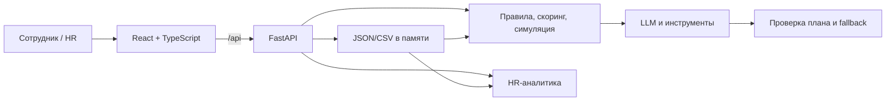

# Career Quest

**AI-навигатор развития сотрудника · HackAlem AI 2026 · Halyk Bank, кейс 1 · команда baursaq**

Career Quest связывает обучение с карьерной целью: показывает разрывы навыков, предлагает 1–3 добровольных шага, объясняет выбор и пересчитывает готовность после завершения. HR видит дефициты компетенций и участие в активностях. Публичных рейтингов сотрудников нет.

## Запуск одной командой

Из корня клонированного репозитория, при запущенном Docker Engine и Docker Compose 2.24+:

```bash
docker compose up --build
```

Открыть **http://localhost:8000**. API: http://localhost:8000/api/health · Swagger: http://localhost:8000/docs. Без `.env` и ключа приложение запускается с детерминированным fallback. Первый запуск скачивает образы и зависимости; интернет нужен для сборки. Остановка: `docker compose down`.

### Без Docker

Нужны Python 3.11+ (на macOS/Linux команда может называться `python3`), [uv](https://docs.astral.sh/uv/getting-started/installation/), Node.js ≥ 22.12 и npm в PATH:

```bash
python run.py
```

Скрипт выполняет `uv sync --frozen`, `npm ci`, production build и запускает FastAPI, который отдаёт также UI. `python run.py --skip-build` повторно использует сборку; `--setup-only` только устанавливает и собирает; `--port 8001` меняет порт. Если 8000 занят другим приложением, остановите его либо используйте другой порт локального launcher.

### Ключ и режимы

Скопировать `backend/.env.example` в `backend/.env` (PowerShell: `Copy-Item backend/.env.example backend/.env`; Linux/macOS: `cp backend/.env.example backend/.env`). Заполнить ключ локально:

```dotenv
OPENAI_API_KEY=<ваш ключ>
USE_MOCKS=false
AGENT_MODE=single
```

Модель и reasoning задаются `OPENAI_MODEL` / `OPENAI_REASONING_EFFORT` по образцу конфигурации и доступу аккаунта. Ключ не вводится во фронтенд, не включается в Docker-образ и не коммитится. Compose читает `.env` при старте; после изменения: `docker compose up -d --force-recreate`.

- `USE_MOCKS=true`: LLM не вызывается, работает движок; удобно для бесплатной воспроизводимой проверки.
- `AGENT_MODE=single` (по умолчанию): один структурированный LLM-вызов выбирает и объясняет кандидатов движка; замеры команды — **4–7 с**.
- `AGENT_MODE=tools`: модель сама выбирает и вызывает инструменты, затем возвращает структурированный план; два раунда Responses API, замеры команды — **5.6–8.6 с**; ближе к лимиту 10 с, поэтому при медленном API чаще уходит в fallback — для стабильной проверки используйте `single`.
- Указанные времена — результаты демонстрационных прогонов команды, не гарантия задержки: она зависит от модели, сети и нагрузки API.
- При отсутствии ключа, таймауте или ошибке используется fallback. Смотрите поле `source` и статус в UI; fallback не является доказательством вызова OpenAI.
- В `single` предусмотрен дополнительный OpenAI-совместимый провайдер через `FALLBACK_*`. В `tools` ошибка ведёт к движку без дополнительного раунда к другому провайдеру.

## Проверка жюри за 90 секунд

1. **0–15 с:** открыть E0072, язык RU. Показать текущую роль, цель и процент готовности. Ожидаемо без ключа: готовность **53%**, первый шаг **API & Performance Testing Workshop**, после отметки — **59%** (с LLM порядок шагов может отличаться).
2. **15–40 с:** «Подобрать шаги». Показать источник LLM/fallback, факторы и раскрыть trace. Назвать три основания рекомендации: целевой грейд, разрыв навыка, история/формат.
3. **40–55 с:** отметить первый доступный шаг пройденным; показать изменение навыков и готовности. Это прогресс обучения, не автоматическое повышение должности.
4. **55–70 с:** HR обзор: дефициты компетенций, участие и загрузка файлов.
5. **70–90 с:** в HR выбрать вместе `data/test_profiles/employees.json` и `data/test_profiles/activity_history.csv`; открыть T001 и показать, почему самый низкий навык не определяет весь план.

Дополнительные сценарии: **E0052 + KK** для казахского объяснения; **E0028** для ловушки обучения после оценки: System Design уже включает прирост EV_006. Скриншоты и фактические результаты — [проверка](docs/verification/README.md). Публичный деплой и резервное видео пока не подготовлены.

## Как работает рекомендация

1. Цель берётся из `career_goal` (включая смену роли), иначе следующий грейд своей роли; Lead без цели сравнивается с текущим профилем.
2. **Эффективный уровень = оценка навыка + прирост от активностей, пройденных после `last_review_date`.** Завершения учитываются в порядке дат с ограничением каждого мероприятия: `new = max(current, min(current + gain, max_level))`; отсутствующий навык = 0. Например, у **E0028** System Design в оценке равен **2**, но EV_006 завершён после оценки и даёт **+1**: эффективный уровень — **3**. Повторно рекомендовать этот уже пройденный курс нельзя.
3. Готовность: `100 × Σ(weight × min(effective, required) / required) / Σ(weight)` для положительных требований, округлённая до целого; вес критичных требований = 2, остальных = 1. Это покрытие требований, не вероятность повышения.
4. Кандидаты проходят ограничения роли/грейда, пререквизитов, расписания, завершений и отказов «Не сейчас». Mandatory исключены. Повтор завершённого курса запрещён, кроме повторяемого EV_036.
5. План строится последовательно: после каждого шага симулируется рост, проверяются новые пререквизиты и пересчитываются следующие кандидаты.
6. LLM выбирает из разрешённых кандидатов и формулирует объяснения на ru/kk/en; сервер проверяет план и считает все числа. Инструменты ограничены текущим сотрудником.

### Веса скоринга

Источник — [engine.py](backend/app/services/engine.py). Баллы складываются; это эвристика, не обученная оценка вероятности успеха.

| Фактор | Вклад |
|---|---:|
| Закрытый уровень требования цели | +1.0 за уровень |
| Критичный навык цели | ещё +1.0 за закрытый уровень |
| Отставание от текущего грейда | +0.75 за закрытый уровень |
| Рост вне требований | +0.2 за уровень |
| Явная карьерная цель при закрытии разрыва | +0.2 |
| Срыв того же мероприятия | −1.0 за случай, максимум −3.0 |
| Срыв похожего мероприятия по навыку | −0.6 за случай, максимум −2.4 |
| Негативный опыт формата: ≥2 других мероприятия и ≥50% неудач | −0.8 |
| Remote + offline | −0.8 |
| Продолжительность >16 ч | −0.2 |
| ≥2 успешных добровольных активности этого типа | +0.4 |
| Средняя собственная оценка этого типа ≥4 | +0.3 |
| Добровольное завершение по тому же навыку | +0.3 |
| Активность уже in_progress | +0.6 |
| Сессия в ближайшие 21 день / self-paced | +0.2 / +0.15 |

### Что делает агент

В режиме `tools` первый раунд модели выбирает от 1 до 6 вызовов:

- `list_candidates` — доступные кандидаты и факторы;
- `get_history_signals` — история текущего сотрудника;
- `simulate_plan` — проверка порядка event_id и прогноз роста.

Второй раунд возвращает 1–3 шага и объяснение; третьего раунда нет. Общий бюджет LLM по конфигурации — 9 секунд, целевой предел HTTP-рекомендации — 10 секунд. Фактические вызовы записываются в trace. Режим и инструменты реализованы в [agents](backend/app/agents/) и [llm.py](backend/app/llm.py). В single последовательность вычислений движка также видна, но она не является выбором инструментов моделью.

## Архитектура



Данные: [data/career_quest](data/career_quest/) — 200 синтетических сотрудников, 60 навыков, 40 мероприятий, 2743 записи истории. Дата среза **2026-10-01** используется как «сегодня». [Схема датасета](data/career_quest/README.ru.md).

## Загрузка и API

HR загружает JSON профилей и CSV истории в исходном формате; также поддерживаются events.json и skills.json. Для сотрудников, упомянутых в CSV, история заменяется содержимым файла — загружайте полную историю этих сотрудников. Всё хранится в памяти одного процесса.

| Действие | API |
|---|---|
| Статус, каталог | `GET /api/health`, `GET /api/catalog` |
| Справочник, профиль | `GET /api/employees?q=`, `GET /api/employees/{id}` |
| Рекомендации | `POST /api/employees/{id}/recommendations`, тело `{"language":"ru"}` |
| Завершение | `POST /api/employees/{id}/complete`, тело `{"event_id":"…"}` |
| «Не сейчас» | `POST /api/employees/{id}/feedback`, тело `{"event_id":"…","action":"not_now"}` |
| HR | `GET /api/hr/overview` |
| Загрузка / сброс | `POST /api/dataset/upload` (multipart `files`), `POST /api/dataset/reset` |

«Не сейчас» исключает шаг до сброса/перезапуска и не записывает наказание в историю.

## Приватность и права

В демо используется **переключатель ролей вместо входа через SSO**, чтобы жюри могло открыть любого сотрудника и проверить сценарии ТЗ, включая загруженные тестовые профили. Все данные синтетические.

Сервер проверяет права для выбранной роли и идентификатора: запрос от сотрудника не получает чужой профиль или HR-данные. Это проверяется в [`test_permissions`](backend/tests/test_smoke.py). Демо передаёт `X-Role: employee|hr` и `X-Employee-Id: E0072`; поскольку эти заголовки задаёт клиент, переключатель не подтверждает личность пользователя и не заменяет производственную авторизацию.

В продакшене — **SSO/JWT с ролями**: сервер получает подтверждённую личность и роль из проверенного токена, ограничивает доступ к профилям и HR-аналитике и ведёт аудит. Публичных рейтингов сотрудников нет.

## Тестовые профили и проверки

[Пять ловушек и ожидаемые свойства](data/test_profiles/EXPECTED.md): lowest-skill/no-show, обучение после оценки, пререквизиты, remote/офлайн, отсутствие полезного шага.

```bash
# Против работающего приложения; добавляет только синтетические T001–T005
python scripts/eval_profiles.py
# Если приложение запущено на другом порту (например, python run.py --port 8011)
python scripts/eval_profiles.py --base-url http://127.0.0.1:8011
# Требует реальный LLM для четырёх непустых сценариев
python scripts/eval_profiles.py --require-llm
# Модульные и API-тесты, без сети
cd backend
uv run pytest -q
# Сборка UI из отдельного терминала в корне
cd frontend
npm ci
npm run build
```

Eval проверяет свойства, а не фиксированный event_id: последовательную доступность, корректный прирост, отсутствие mandatory/повторов и причины выбора. PASS в mock-режиме не подтверждает качество реального LLM. [Протокол проверок и ограничения](docs/verification/README.md).

## Ценность и ограничения

Ожидаемая ценность: сотрудник понимает следующий добровольный шаг, HR может обсуждать бюджет обучения по дефицитам компетенций. Эффект на вовлечённость и удержание пока не измерен. Для пилота измерять добровольное завершение, долю принятых рекомендаций и изменение покрытия навыков; не использовать сигналы вовлечённости как автоматическую оценку сотрудников.

- Импорты, прогресс и «Не сейчас» теряются при перезапуске; один процесс, без постоянной БД.
- Языки объяснений ru/kk/en; основной интерфейс русский.
- Зависимость от сети, доступа к API и бюджета времени; fallback виден явно.
- Веса эвристические; нужны HR-валидация, оценка качества объяснений и пилот.
- GitHub Actions ранее не запускался из-за блокировки биллинга организации. Локальные проверки не подменяют зелёный CI.

## Что дальше

- Интеграция с **LMS и журналом посещаемости**, чтобы обновлять завершения и эффективные навыки без ручного ввода.
- **Конструктор мероприятий для HR**: аудитория, развиваемые навыки, пререквизиты и расписание.
- **Прогноз оттока** как сигнал для поддержки сотрудника, с проверкой качества и приватности; без автоматических кадровых решений.
- **Добровольные награды без рейтингов** и публичного сравнения сотрудников.
- **Календарь и мессенджер**: запись на выбранный шаг и напоминания по согласию сотрудника.

Это план развития; перечисленные интеграции и функции пока не реализованы.

## Команда и вклад

| Участник | Зона |
|---|---|
| Azamat Zhenisov | Backend/AI, многофакторный движок, агент, инструменты и тесты |
| Umar Kumyrkan | Интерфейс сотрудника/HR, интеграция API, состояния и trace |
| Aniyar Baibossyn | Docker и launcher, профили жюри, HTTP eval, README и проверка запуска |

[План команды](docs/TEAM_PLAN.md) · [Правила работы](AGENTS.md) · [Вклад Анияра](docs/contributions/aniyar.md).

### Как мы использовали Codex

Каждый участник работал со своей AI-сессией в согласованной зоне файлов. Codex помогал писать, проверять и исправлять код; решения и приоритеты согласовывали участники. Изменения помечены `[codex]`, авторство видно в Git. [Доказательства и инструкции для скриншотов](docs/codex/README.md). Снимки интерфейса приложения показывают результат, но не заменяют скриншоты сессий Codex; их участники добавляют из своих сессий.
