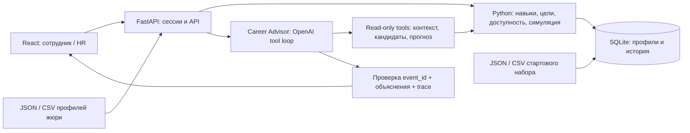

# Архитектура Career Quest

## Продукт
Сотрудник видит текущие навыки, цель, разрывы, историю и 1–3 следующих действия. Для каждого действия есть объяснение и прогноз прироста. По подтверждению выполнения backend обновляет историю и пересчитывает прогресс. HR видит агрегированные дефициты, участие и сотрудников без доступного шага.

## Граница ответственности
**Backend** вычисляет истину: навыки, допустимые мероприятия, prerequisites, gain/max_level, историю, проценты и права. **LLM** выбирает последовательность действий и объясняет компромиссы с учётом истории. LLM не завершает активности и не меняет оценки.

Один агент с несколькими инструментами достаточен. Agentic-сценарий: запросить контекст → получить кандидатов → при необходимости сравнить прогноз нескольких действий → выбрать шаги → вернуть проверенный результат с источниками. Трассировка показывает вызовы инструментов, параметры, краткие факты и время, а не скрытые рассуждения модели.

## Модули
| Путь | Назначение | Владелец |
|---|---|---|
| backend/app/store.py | Загрузка seed, SQLite, импорт, сохранение истории | Aniyar |
| backend/app/domain.py | Пересчёт навыков, цели, кандидаты, симуляция, HR | Aniyar |
| backend/app/main.py | HTTP, авторизация, файлы, статический frontend | Aniyar |
| backend/app/schemas.py | Валидация входных данных | Aniyar |
| backend/app/agent/ | AI policy, OpenAI transport, инструменты, валидация результата | Umar |
| frontend/ | UI сотрудника/HR, клиент API, импорт, trace | Azamat |
| evals/ | Проверочные профили и отчёт о качестве | Umar |

## Решения для 3 часов
- SQLite вместо внешней БД; нет отдельного сервиса, легко воспроизвести.
- Полный структурированный набор содержит только 200 человек/40 событий; векторный поиск не нужен.
- OpenAI в основной цепочке. Модель выбирается через `OPENAI_MODEL`, ключ через `.env` только на сервере. NVIDIA — необязательный резерв после приёмки всех must-have.
- Стартовый режим `rules` нужен для разработки UI без ключа. Это не готовая AI-часть для сдачи; интерфейс должен явно показывать режим.
- Серверные сессии разграничивают сотрудника и HR. Демо-пароли не являются промышленной системой идентификации.
- Для продукта нет автоматического повышения грейда: покрытие требований помогает принять решение сотруднику и руководителю.
- Один процесс Uvicorn, один worker. При перезапуске SQLite сохраняет данные, сессии требуют повторного входа.

## Риски и проверки
1. Полный цикл AI должен впервые пройти в первые 45 минут работы Umar. Проверить реально доступную API-модель, не выводить её имя из названия модели в Codex.
2. Дополнительные профили жюри загружаются с историей; нельзя хардкодить employee_id или тексты проверок.
3. После completion и import результат и HR пересчитываются; кэш рекомендаций должен учитывать версию данных, либо отсутствовать.
4. Двойной клик completion не должен дважды увеличить навык. Клуб EV_036 может повторяться в разные даты; в демо повтор на ту же дату идемпотентен.
5. Для защиты demo: стартовый набор работает без сети, но AI-режим честно требует API. Задержку измеряем; целевой предел рекомендации 10 секунд.
