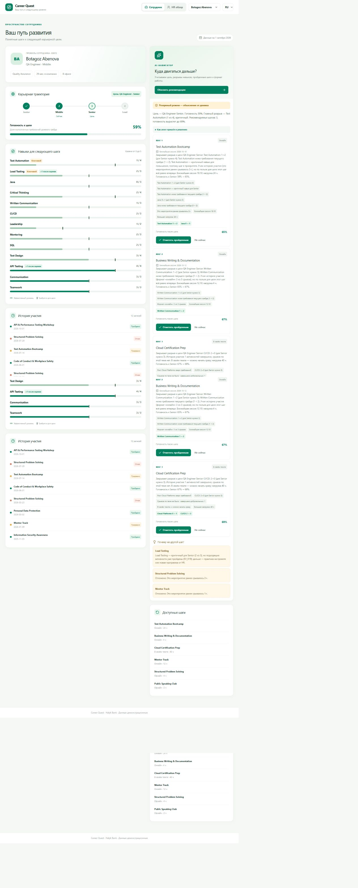
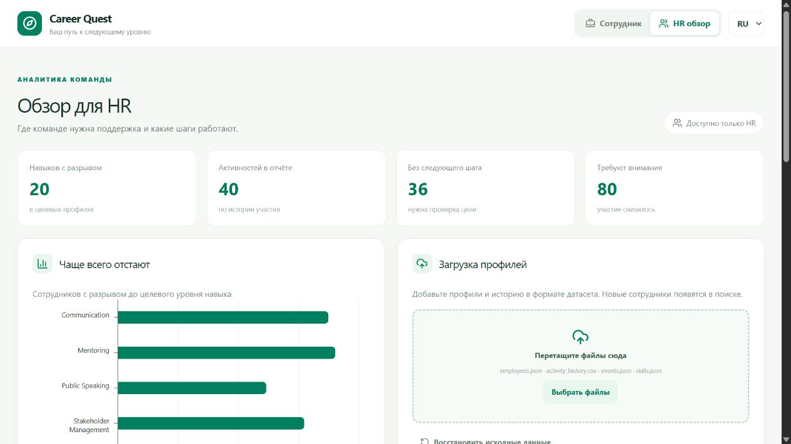

# Проверка Career Quest

Проверка 23 сентября 2026, Windows + Docker Desktop Linux Engine.

## Подтверждено

- `eceb935`: чистый локальный клон (`git clone --no-local`), `docker compose build` завершился успешно; `docker compose up -d --wait` — контейнер Healthy. Файл `.env` отсутствовал, секреты не копировались.
- `python run.py --setup-only`: uv установил зависимости из frozen lock, npm ci и production build прошли.
- `python run.py --skip-build --port 8001`: HTTP API доступен, пять сценариев eval прошли; [результат](eval-mock.json).
- Backend после интеграции новых агентных тестов (`41cd2a7`): **25 passed in 3.79s**, включая mock-проверки оркестрации Responses; платная сеть в тестах не используется.
- Чистая копия обновлена до `41cd2a7`: повторный `docker compose up --build -d --wait` успешен, UI собран, контейнер Healthy.
- HTTP eval против этого контейнера: **5/5 PASS**, [результат](eval-docker.json). Ключа нет, ответы fallback.
- Ручной браузерный сценарий E0072: рекомендации → завершение первого шага → готовность **53% → 59%**, новая запись первой в истории, рекомендации обновились. HR-экран загрузил аналитику и форму импорта.





## Как повторить

```bash
docker compose up --build
python scripts/eval_profiles.py
```

Тестовые профили добавляются в текущий процесс. Чтобы начать с исходных данных, перезапустите контейнер; прогресс хранится в памяти.

## Незакрытые внешние пункты

- Реальный LLM на машине Анияра пока не проверен: нужен локально настроенный ключ. Проверки mock подтверждают свойства движка, не качество модели. Отчёт коллеги о реальном LLM не выдаётся за собственный запуск.
- Скриншоты сессий Codex должны добавить участники.
- Ссылка на платформу сдачи и дедлайн запрошены у участника. Нажатие «Сдать решение» не выполнено.
- Тег submission ставится после проверки итогового SHA и готовности команды; существующий тег не перезаписывается.
- GitHub Actions run 35849291598 был заблокирован до запуска шагов из-за billing issue. Это не результат тестов.
